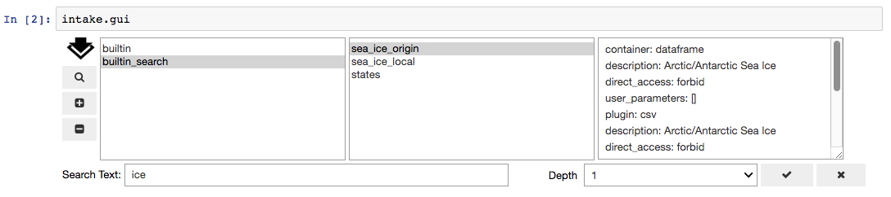
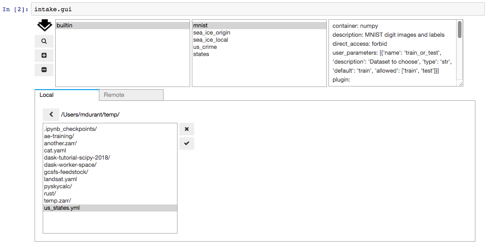
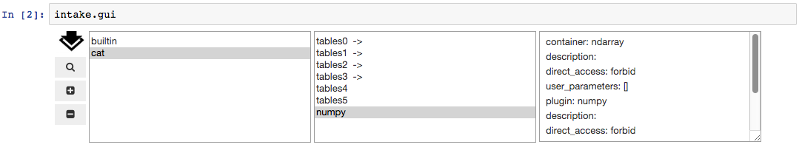
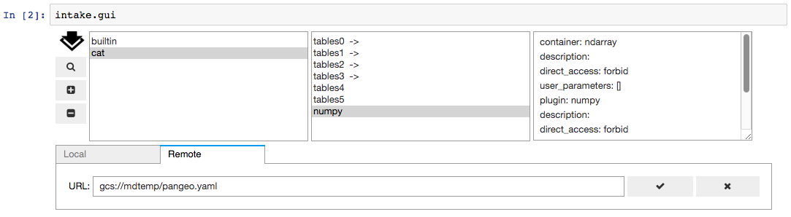

GUI
===

Using the Data Browser
----------------------

**Note**: the data browser requires ``ipywidgets`` to be available in the current environment

The Intake top-level singleton ``intake.gui`` gives access to a graphical data browser
within the Jupyter notebook. To expose it, simply enter it into a code cell (Jupyter
automatically display the last object in a code cell).

.. image:: _static/images/gui1.png

New instances of the GUI are also available by instantiating ``intake.DataBrowser``,
where you can specify a set of catalogs to initially include.

The GUI contains:

- a list of catalogs. The "builtin" catalog, displayed by default, includes data-sets installed
  in the system, the same as ``intake.cat``.

- a list of entries within the currently-selected catalog. Entries marked with ``" ->"``
  are themselves catalogs, clicking them will load the catalog and update the left-hand
  listing. Clicking any other entry will display some basic information in the right-hand text
  box.

- The following controls:

  -  Search: opens a sub-panel for finding entries in the currently-selected catalog (and it's
     sub-catalogs)

  -  Add: opens a sub-panden for adding catalogs to the interface, by either browsing for a local
     YAML file or by entering a URL for a catalog, which can be a remote file or Intake server

  -  Remove: delete the currently-selected catalog from the list

Search
~~~~~~

The sub-panel opened by the Search button allows for the entry of free-form text. Upon execution
of the search with the check button, the currently-selected catalog will be searched. Entries will
be considered to match if any of the entered words is found in the description of the entry (and
this is case-insensitive). If any entries match, a new entry will be made in the catalog list,
with the suffix "_search".

Some catalogs can contain nested sub-catalogs. The Depth selector allows the search to be limited
to the stated number of nesting levels. This may be necessary, since, in theory, catalogs can
contain circular references, and therefore allow for infinite recursion.

Add Catalogs
~~~~~~~~~~~~

The Add button exposes a sub-panel with two main ways to add catalogs to the interface

A *file selector*. Use the folder icon to open this below the main GUI. You can navigate
around the filesystem, and select the catalog file you need. Use the tick icon to accept
the selection, or the cross button to close the selector without accepting the selection.
If accepted, the catalog will appear in the listing, unless parsing of the file fails:

A *URL editor*. Any URL is valid here, including cloud locations, ``"gcs://bucket/..."``, and
intake servers, ``"intake://server:port"``. Without a protocol specifier, this can be a
local path. Again, use the check button to accept the value, and attempt to load the file
into the interface's catalogs list.

Finally, you can add catalogs to the interface in code, using the ``.add_cat()`` method,
which can take filenames, remote URLs or an existing ``Catalog`` instance.

Using the Selection
-------------------

Once catalogs are loaded and the correct entry has been identified and selected, the item
in question will be available as the ``.item`` attribute (``intake.gui.item``), which has informational
methods available and can be opened as a data source, as with any catalog entry:

.. code-block:: python

   In [ ]: intake.gui.item.describe_open()
   Out   : {'plugin': 'csv',
            'description': 'Arctic/Antarctic Sea Ice',
            'direct_access': 'forbid',
            'metadata': {},
            'args': {'urlpath': 'https://timeseries.weebly.com/uploads/2/1/0/8/21086414/sea_ice.csv',
            'metadata': {}}}

   In [ ]: s = intake.gui.item()  # may specify parameters here
           s.read()
   Out   : < some data >

   In [ ]: intake.gui.item.plot()  # or skip data source step
   Out   : < graphics>