GUI
===

Using the GUI
-------------

**Note**: the GUI requires ``panel`` and ``bokeh`` to
be available in the current environment.

The Intake top-level singleton ``intake.gui`` gives access to a graphical data browser
within the Jupyter notebook. To expose it, simply enter it into a code cell (Jupyter
automatically display the last object in a code cell).

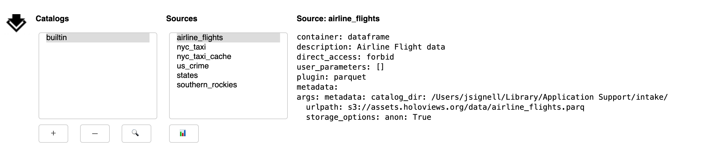

New instances of the GUI are also available by instantiating ``intake.interface.gui.GUI``,
where you can specify a list of catalogs to initially include.

The GUI contains three main areas:

- a **list of catalogs**. The "builtin" catalog, displayed by default, includes data-sets installed
  in the system, the same as ``intake.cat``.

- a **list of sources** within the currently selected catalog.

- a **description** of the currently selected source.

Catalogs
--------
Selecting a catalog from the list will display nested catalogs below the parent and display
source entries from the catalog in the **list of sources**.

Below the **lists of catalogs** is a row of buttons that are used for adding, removing and
searching-within catalogs:

-  **Add**: opens a sub-panel for adding catalogs to the interface, by either browsing for a local
   YAML file or by entering a URL for a catalog, which can be a remote file or Intake server

-  **Remove**: deletes the currently selected catalog from the list

-  **Search**: opens a sub-panel for finding entries in the currently selected catalog (and its
   sub-catalogs)

Add Catalogs
~~~~~~~~~~~~

The Add button (+) exposes a sub-panel with two main ways to add catalogs to the interface:

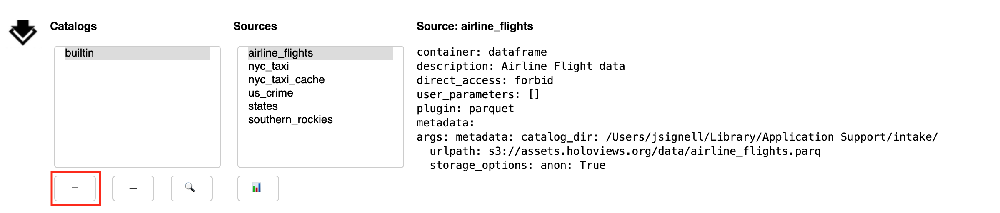

This panel has a tab to load files from **local**; from that you can navigate around the filesystem
using the arrow or by editing the path directly. Use the home button to get back to the starting
place. Select the catalog file you need. Use the "Add Catalog" button to add the catalog to the list
above.

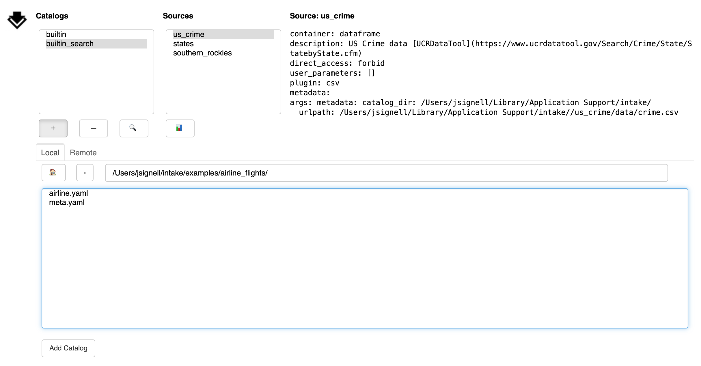

Another tab loads a catalog from **remote**. Any URL is valid here, including cloud locations,
``"gcs://bucket/..."``, and intake servers, ``"intake://server:port"``. Without a protocol
specifier, this can be a local path. Again, use the "Add Catalog" button to add
the catalog to the list above.

.. image:: _static/images/gui_add_remote.png

Finally, you can add catalogs to the interface in code, using the ``.add()`` method,
which can take filenames, remote URLs or existing ``Catalog`` instances.

Remove Catalogs
~~~~~~~~~~~~~~~

The Remove button (-) deletes the currently selected catalog from the list. It is important to
note that this action does not have any impact on files, it only affects what shows up in the list.

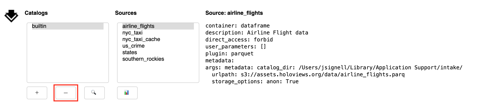

Search
~~~~~~

The sub-panel opened by the Search button (🔍) allows the user to search within the selected catalog

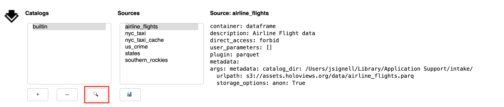

From the Search sub-panel the user enters for free-form text. Since some catalogs contain nested sub-catalogs,
the Depth selector allows the search to be limited to the stated number of nesting levels.
This may be necessary, since, in theory, catalogs can contain circular references,
and therefore allow for infinite recursion.

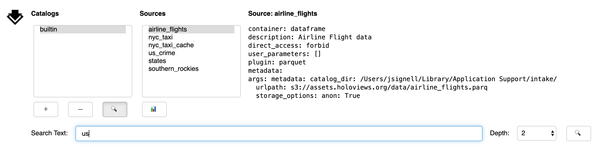

Upon execution of the search, the currently selected catalog will be searched. Entries will
be considered to match if any of the entered words is found in the description of the entry (this
is case-insensitive). If any matches are found, a new entry will be made in the catalog list,
with the suffix "_search".

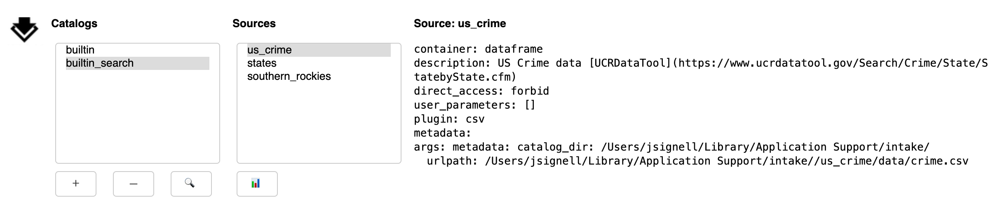

Sources
-------
Selecting a source from the list updates the description text on the left-side of the gui.

Below the **list of sources** is a row of buttons for inspecting the selected data source:

-  **Plot**: opens a sub-panel for viewing the pre-defined (specified in the yaml) plots
   for the selected source.

Plot
~~~~

The Plot button (📊) opens a sub-panel with an area for viewing pre-defined plots.

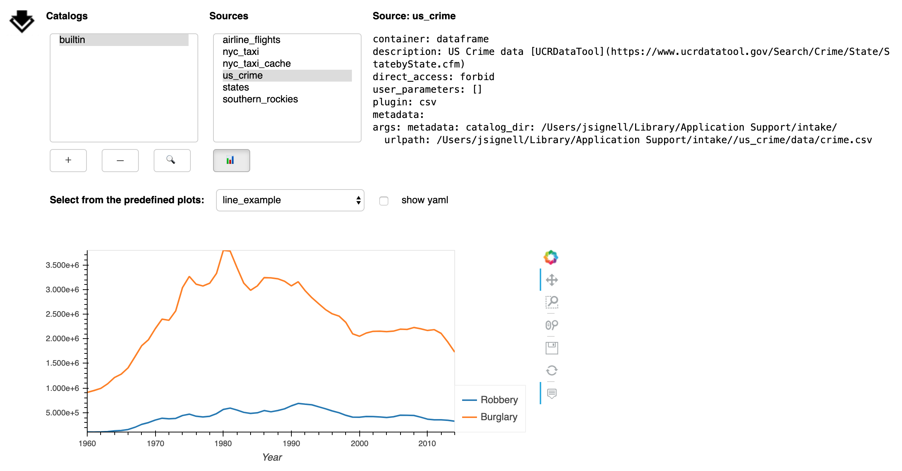

These plots are specified in the catalog yaml and that yaml can be displayed by
checking the box next to "show yaml".

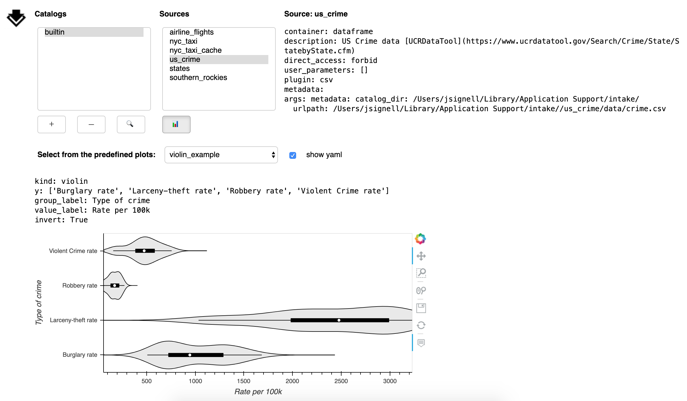

The holoviews object can be retrieved from the gui using ``intake.interface.source.plot.pane.object``,
and you can then use it in Python or export it to a file.

Interactive Visualization
'''''''''''''''''''''''''

If you have installed the optional extra packages `dfviz`_ and `xrviz`_, you can
interactively plot your dataframe or array data, respectively.

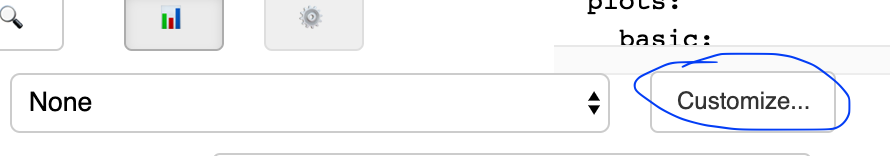

.. _dfviz: https://dfviz.readthedocs.io/
.. _xrviz: https://xrviz.readthedocs.io/

The button "customize" will be available for data sources of the appropriate type.
Click this to open the interactive interface. If you have not selected a predefined
plot (or there are none), then the interface will start without any prefilled
values, but if you do first select a plot, then the interface will have its options
pre-filled from the options

For specific instructions on how to use the interfaces (which can also be used
independently of the Intake GUI), please navigate to the linked documentation.

Note that the final parameters that are sent to ``hvPlot`` to produce the output
each time a plot if updated, are explicitly available in YAML format, so that
you can save the state as a "predefined plot" in the catalog. The same set of
parameters can also be used in code, with ``datasource.plot(...)``.

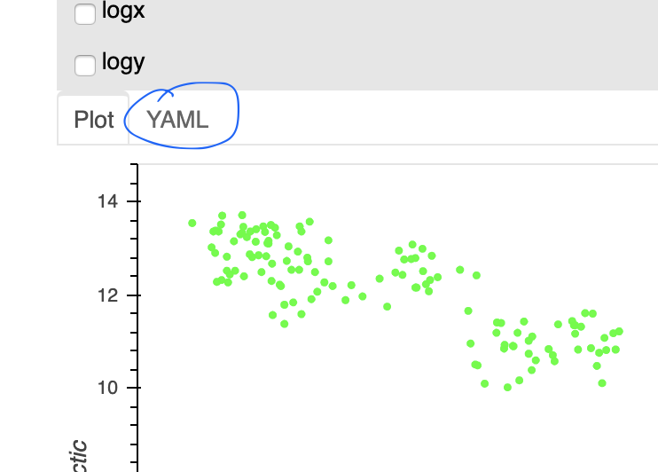

Using the Selection
-------------------

Once catalogs are loaded and the desired sources has been identified and selected,
the selected sources will be available at the ``.sources`` attribute (``intake.gui.sources``).
Each source entry has informational methods available and can be opened as a data source,
as with any catalog entry:

.. code-block:: python

   In [ ]: source_entry = intake.gui.sources[0]
           source_entry
   Out   :
   name: sea_ice_origin
   container: dataframe
   plugin: ['csv']
   description: Arctic/Antarctic Sea Ice
   direct_access: forbid
   user_parameters: []
   metadata:
   args:
     urlpath: https://timeseries.weebly.com/uploads/2/1/0/8/21086414/sea_ice.csv

   In [ ]: data_source = source_entry()  # may specify parameters here
           data_source.read()
   Out   : < some data >

   In [ ]: source_entry.plot()  # or skip data source step
   Out   : < graphics>

