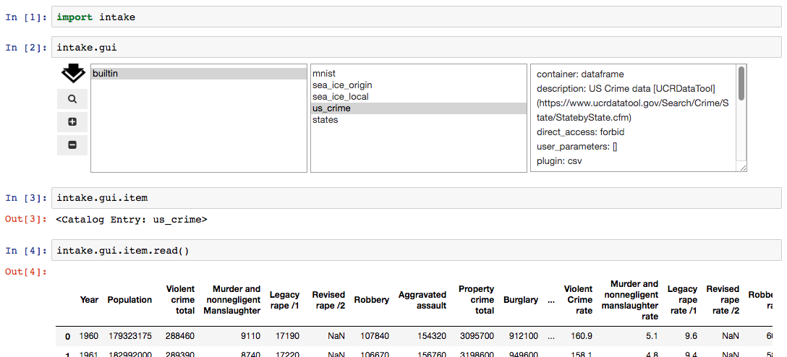

GUI
===

Using the Data Browser
----------------------

**Note**: the data browser requires ``ipywidgets`` to be available int he current environment

The Intake top-level singleton ``intake.gui`` gives access to a graphical data browser
within the Jupyter notebook. To expose it, simply enter it into a code cell (Jupyter
automatically display the last object in a code cell).

The GUI contains:

- a list of catalogs. This will contain only "builtin" initially; it is also possible to
  construct instances of ``intake.gui.DataBrowser()`` with an explicit set of catalogs.

- a list of entries within the currently-selected catalog. Entries marked with ``" ->"``
  are themselves catalogs, clicking them will load the catalog and update the left-hand
  listing. Clicking any other entry will display some basic information in the right-hand text
  box.

- a URL editor. This is the primary location where natalogs can be entered for loading by
  the interface. Any URL is valid here, including cloud locations, ``"gcs://bucket/..."``, and
  intake servers, ``"intake://server:port"``. Without a protocol specifier, this should be a
  local path. Use the Add button (+) to load the given URL.

- a file selector. Use the folder icon to open this below the main GUI. You can navigate
  around the filesystem, and select the catalog file you need. Use the tick icon to accept
  the selection (it gets entered into the URL line, above), or the cross button to close
  the selector without accepting the selection.

Once catalogs are loaded and the correct entry has been identified and selected, the item
in question will be available as the attribute ``intake.gui.item``, which has informational
methods available and can be opened as a data source, as with any catalog entry:

.. code-block:: python

   In [ ]: intake.gui.item.describe_open()
   Out   : {'plugin': 'csv',
            'description': 'Arctic/Antarctic Sea Ice',
            'direct_access': 'forbid',
            'metadata': {},
            'args': {'urlpath': 'https://timeseries.weebly.com/uploads/2/1/0/8/21086414/sea_ice.csv',
            'metadata': {}}}

   In [ ]: s = intake.gui.item()  # may specify parameters here
           s.read()
   Out   : < some data >

   In [ ]: intake.gui.item.plot()  # or skip data source step
   Out   : < graphics>