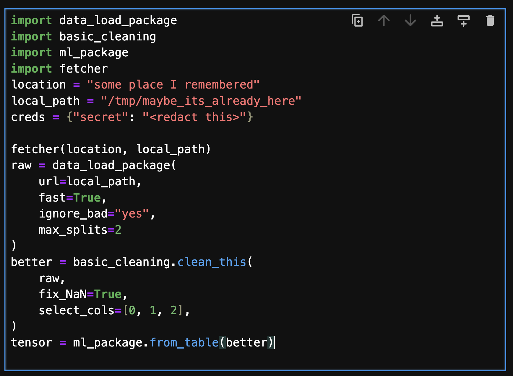

Scope
=====

Here we lay out what Intake is, why you might want to use it, main features and also
a few reasons you may wish to look elsewhere.

Motivation
----------

Data scientists, analysis, ML/AI developers and engineers want to spend their time working
with data to produce models, results and insights. Those first few lines or cells in a workflow
to get to the data are annoying, often wrong and brittle.
Consider the following cell of realistic-looking code.

This cell encodes several steps it takes to produce the object of interest for the user, including
defining some location URL, fetching data, loading, cleaning and converting data. It refers to
multiple packages, and hard-codes various arguments directly. This is clearly messy code, but it
is extremely common - in fact, most data-centric workflows start like this. Now imagine finding
and using this dataset for a new project, or when the upstream location, format or types have changed.
Further more, the steps are highly specific - if you decide you need a different compute engine,
or the data moves to a different storage service, it is painful to fix this. If the same dataset is
used in many places, you will need to remember to fix it in each place.

Wouldn't it be nice if you could declare your data and pipeline just once? Then you can

- version control your data set descriptions as you would for code (and maybe data files)
- share your data definitions with others, just by writing this prescription to any shared space
- update all users of this data in a single place, single source of truth
- encode a set of transforms as part of a data-oriented processing framework
- decide to load and process the same data but with different engines
- automatically encode python statements into data decriptions
- convert between dozens of data types

Counter indications
-------------------

The following are some situations where you might not be interested in Intake:

- you only ever read one type of file with one package, e.g., ``pd.read_csv``.
  In this case, Intake can still
  serve to describe and enumerate data sources, but you miss out on most of the functionality.
- you only ever work on data sources by yourself and have no reasons to direct other people in how
  to read data (not be the consumer of such descriptions).
- all your data needs are already met by some other data service by itself, for example a
  set of tables/procedures/views/queries on a SQL database.
- you have data that is not read by anything in Intake (but maybe you could pretty easily add any
  reader you need).
- you don't yet see any benefit of describing your datasets in catalogs.

What Intake Isn't
-----------------

This is not a workflow running system (maybe use Airflow, Celery, Prefect, etc.) nor
a compute engine (although we hook into spark, dask, ray and such). Our scope is limited
to describing data and how to load it. Here, "load" includes transforms and cleaning
with the engine of your choice to get to something ready for analysis.
We delegate all calls to other third-party packages, so you can think of the descriptions
as being "what to call".

Relationship to ``fsspec``
--------------------------

``fsspec`` is a library concerned only with reading bytes from various stores. It has become
the standard (but not only) package for this in the python/data ecosystem and is supported by
many other packages. Intake will make use of ``fsspec`` for many file readers, encoding
"storage_options` (further arguments that ``fsspec`` understands) when necessary.

Where a reader doesn't understand ``fsspec``, "storage_options" are ignored, and in some
cases the files might need to be downloaded locally before being accessible. Intake prefers
using ``fsspec``, but it is not necessary.

Relationship to ``dask``
------------------------

Intake originally came out of the same stable as `dask`_, and this was implicit in all of the
"sources" in V1. Since then, many more compute engines have become available in python and
some that already existed have become more convenient (e.g., Spark). We no longer require or
even prefer ``dask``, but it is, of course, a fine choice for out-of-core, parallel and
distributed workloads.

.. _dask: https://dask.org

.. _v1:

Relationship to V1
------------------

We aim to be largely backward compatible with pre-V2 Intake sources and catalogs.
Many data sources have been rewritten
to use the new framework, and many rarely-used features have been removed. In particular, the
following features are no longer supported for V1 sources:

- the intake server (use ``tiled`` instead)
- caching (use ``fsspec`` caching instead or custom caching pipelines)
- "persist" and "export" (use the new converters and output classes)
- automatic ``hvplot`` (this is now an "output" converter for pandas and xarray types)
- some niche source features such as CSV file pattern matching

In addition, not all existing ``intake_*`` packages have corresponding readers in Take2, but we are
making progress.
