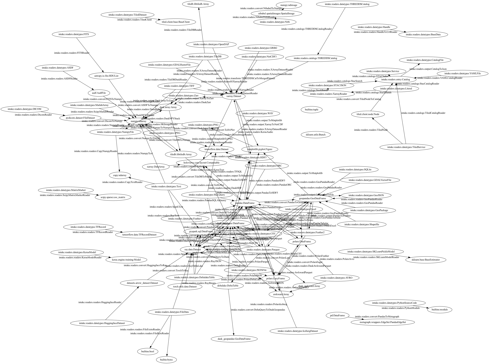

Creator Walkthrough
===================

As soon as you have used a catalog, you may wonder how to create the - look no further.
EVen if you don't make catalogs, you may find the data and reader class recommenders useful.

Preamble
--------

Intake is a bunch of _readers_. A reader is a class that encodes how to load some
particular data, including all the arguments that will be passed to some third-party
package. Thus, you can encode anything from the simplest ``pd.read_csv`` call to
far more complex things. You can also act on readers, to record a set of
operations known as a Pipeline. A Pipeline is just a special kind of reader.

Catalogs contain readers and data definitions. Readers can and should be saved in Catalogs,
which can in the simplest case be saved as text files, but can also be generated from
many data services. Catalogs and readers are the central themes of intake.

.. note::

    "Load" means make a machine representations: many data containers may be lazy,
    where you get an object on which you can act, but the data is only read on
    demand for actions that require it.

Simple Example
--------------

Let's consider a typical Pandas line to read a CSV file. Although there are many ways to
load data in python, this is one of the most common.

.. code-block:: python

    import pandas as pd
    url = "s3://mymdtemp/intake_1.csv"
    df = pd.read_csv(url, storage_options={"anon": True}, usecols=[1, 2])

Simple enough, so long as you have ``fsspec`` and ``s3fs`` installed. Note the use of extra
options to the storage backend (this file is public) and up-front column selection.

To encode this with intake, you can do

.. code-block:: python

    import intake
    reader = intake.reader_from_call(
        'df = pd.read_csv(url, storage_options={"anon": True}, usecols=[1, 2])')

Where you could have used ``_i``, the IPython shorthand for "the last line of input" instead of
the copy/pasted line. The "reader" object encodes all the things we asked for, and we
can execute the process by calling ``reader.read()`` to get the same result as before. So
what's the point?

We can put this reader into a catalog:

.. code-block:: python

    cat = intake.entry.Catalog()
    cat["tute"] = reader
    cat.to_yaml_file("intake_1.yaml")

where the path could be anyplace you can write to, such as a local file. This can be the
whole of the "catalog producer" workflow.

A public version has been put alongside the CSV, so as the data consumer, you can read this
wherever you are. The following could be the whole of a data consumer workflow:

.. code-block:: python

    import intake
    cat = intake.from_yaml_file("s3://mymdtemp/intake_1.yaml", anon=True)
    cat.tute.read()

Note that ``cat.tute`` has a lot of optional metadata that we have not filled out. It
also provides documentation of the function it will call at read time (``cat.tute.doc()``),
in case you want to add or change arguments.
The point is not to know every time which specific dataset you need (although that happens too),
but a way to view all of your available data and find the right one for your job before loading it.

Similarly, we could have started with the URL alone

.. code-block:: python

    intake.datatypes.recommend("s3://mymdtemp/intake_1.csv", storage_options={"anon": True})

Which says that this URL likely refers to a CSV file. In this case, that is not surprising,
but in many cases, it can be useful to have Intake guess the file type for us.

**Summary**: In this section we saw one way to easily create a data loading spec ("reader"), save it
into a catalog and then load this data using the catalog. This is data distribution
without any server.

Slightly less Simple
--------------------

Let's do trivial transforms to our trivial dataset. Continuing from above:

.. code-block:: python

    cat["capitals"] = reader.a.str.capitalize()
    cat["inverted"] = reader.sort_values("b", ascending=False)
    cat.to_yaml_file("intake_1.yaml")

Again, this could be persisted anywhere, but the path above includes all three datasets:

.. code-block:: python

    import intake
    cat = intake.from_yaml_file("s3://mymdtemp/intake_1.yaml", anon=True)
    list(cat)  # -> ['capitals', 'inverted', 'tute']

Now we have three datasets all based off the same original file. Investigating ``cat.data``,
you can see that there is exactly one definition: a CSV with the URL as defined above,
and investigating ``cat.entries``, you can see how the three things reference it and
one-another. We can also make readers that depend on multiple data sources:

.. code-block:: python

    cat["multi"] = cat.tute.assign(c=cat.capitals)

(Since we only have one base dataset, this depends on itself, but there is still only
one value in ``cat.data``, the original CSV)

.. note::

    We made derived datasets by knowing and calling the pandas API explicitly. These methods
    are available by tab-completion (in a jupyter session, for example). Or one might
    interrogate the ``.transform`` attribute of any reader to know which methods are
    defined in Intake, or expected to be available for the given type (a DataFrame in
    this case).

**Summary** : here we showed that you can create processing pipelines from datasets and save
these derived datasets as new definitions. The syntax is the same as whatever package you
intend to do the actual processing.

Multiple Readers
----------------

In the previous examples, we knew we were starting with a CSV and wanted to make
pipelines using pandas. Often, life is not that simple! It can take work to figure
out where to look for data, and then what type that data is and which engine is
best suited to work with it. In fact, the answer to that might depend on a number
of factors and not be the same for all users on all days. So, Intake allows
you to make multiple pipelines from the same data with different engines and
leave the choice of which to use to runtime. It will also help you find
pathways to transform your data between frameworks to get to your desired outcome.

There is only one data entity in our example mini-catalog, so let's grab it:

.. code-block:: python

    cat = intake.from_yaml_file("s3://mymdtemp/intake_1.yaml", anon=True)
    key = list(cat.data)[0]
    data = cat[key]

.. note::

    The key of this in ``cat.data`` is a hashed hex string. We could have given this
    data entry a name, but it was auto-added to the catalog when assing the "tute"
    reader.

This is a ``CSV`` data instance, a subclass of ``intake.readers.datatypes.BaseData``.
It can be read with multiple readers, since CSVs are so common. ``data.possible_readers``
lists the classes that can read this grouped by whether they can be imported, and
``data.possible_outputs`` gives the expected output instance from each importable
reader. In both case, more specific readers (for CSVs) come before the less specific
ones (that read any file). We could instantiate these readers directly, or call
the ``.to_reader`` method to pick one. The following two are equivalent, and
pick dask.dataframe as the backend to read the data (assuming it is installed).

.. code-block:: python

    intake.readers.readers.DaskCSV(data)
    data.to_reader("dask")  # this searches the outputs for something matching "dask"

Both lines produce a DaskCSV reader, which we can also put in a catalog, or just
``.read()`` it to get a ``dask.dataframe.DataFrame`` output. We could have done the
same for Ray, Spark or DuckDB (and more to come, like cuDF, Modin, Polars, and
that's just for dataframes).

**Summary**: a dataset can be read with multiple reader types, and we can save prescriptions
in a catalog for each, with various sets of parameters is desired, but still have
the ability to go back to the data definition and pick something else.

Conversions
-----------

Intake can handle many filetypes (see ``intake.datatypes``) and many readers with
various engines/packages (see ``intake.readers.readers``). These are, by design,
simple to write, and many more will be coming to fill out the data loading space.
However, you may well find yourself needing to convert from one representation to
another. For example, you may wish to use DuckDB for efficient querying of remote
Parquet files, but then want the output as a Pandas dataframe for building an ML
model. You can, of course, just save the DuckDB reader with the query, and convert
to Pandas in every session, but wouldn't it be nice to encode that you mean to
do this conversion = and then you can chain further operations with the Pandas API,
if you wish.

Intake supports the following web of conversions, and more coming all the time.
It's too complex to see the details!

Finding the specific conversion search might look something like

.. code-block:: python

    data = intake.datatypes.Parquet("my.parq")
    reader = data.to_reader("Duck")
    reader.transform

Where from the repr we see that a converter ``DuckToPandas`` exists and does what you expect.

Or, you can often find a whole chain of conversions to get to where you want to go; starting
with either a URL (and any storage_options), data instance or reader instance. For the
reader above, let's say we want to get an image (PNG) representation:

.. code-block:: python

    intake.auto_pipeline(reader, outtype="PNG")

produces a pipeline going DuckDB->Pandas->matplotlib Figure->PNG file. If you try to run it
it will fail, saying that the output node (the last one) needs a URL. So you would actually
do the following:

.. code-block:: python

    output = intake.auto_pipeline(reader, outtype="PNG")
    output(url="out.png").read()

Where obviously you could make extra arguments to the ToMatplotlib stage to customise the
graph. Any arguements or any node in the pipeline can be changed before running or
persisting in a catalog, and any pipeline from a catalog can have its arguments overridden
at runtime, if desired.
The final PNG file would be a nice addition to the metadata of the original data prescription,
see ``intake.readers.metadata_fields`` for suggested field names and descriptions.

.. note::

    There are many classes derived from ``BaseConverter``, and by convention those we call
    "converters" keep the same data but in different representations, "transforms" change the data
    but keep the same representations, and "output" produce side-effects and return a
    BaseData instance. These rules are loose and may be violated.

**Summary**: Intake handles not only many data types and compute engines, but knows how to
convert between them, providing some handy utilities for guessing the best pipeline to
get to a given output.

Complex Example
---------------

The following code performs a rather typical workflow, recreating the "persist" functionality
in V1 (using only standard blocks, no special code). This is somewhat verbose and explicit, for
the sake of clarity.

.. note::

    Saving local copies of files is more common, and can usually be achieved by adding
    "simplecache::" (and a defined local directory) to the URL for readers that use `fsspec``.
    However, some data sources are not files, and of course it is often a good idea to
    save a more efficient format of the data, as in the case here.

.. code-block:: python

    from intake.readers.readers import Condition, PandasCSV, PandasParquet, FileExistsReader

    fn = f"{tmpdir}/file.parquet"
    data = intake.readers.datatypes.CSV(url=dataframe_file)
    part = PandasCSV(data)

    output = part.PandasToParquet(url=fn).transform(PandasParquet)
    data2 = intake.readers.datatypes.Parquet(url=fn)
    cached = PandasParquet(data=data2)
    reader2 = Condition(cached, if_false=output, condition=FileExistsReader(data2))

The pipeline can be described as:
- there is a CSV file, ``dataframe_file``
- there may be a parquet version of this, ``fn``
- if the parquet file does not exist, load the CSV using pandas, save it to parquet and load that
- if the parquet file already exists, load that without looking at the CSV.

There are of course many ways that one might achieve this and more complex "conditions" for when
to run the conversion pipeline. However, the ``reader2`` object encodes the whole thing, and can
be safely stored in a catalog. A user can then use this standard condition, choose to remake the
parquet, or just load the CSV without accessing the parquet at all. It would be reasonable to
update the metadata of ``data`` or the readers to show the expected columns types and row count
(if they are not expected to change).

**Summary**: you can branch and join pipelines and save the whole complicated tree in catalogs,
allowing complex patterns like conditional caching.

Extracting User Parameters
--------------------------

To come
